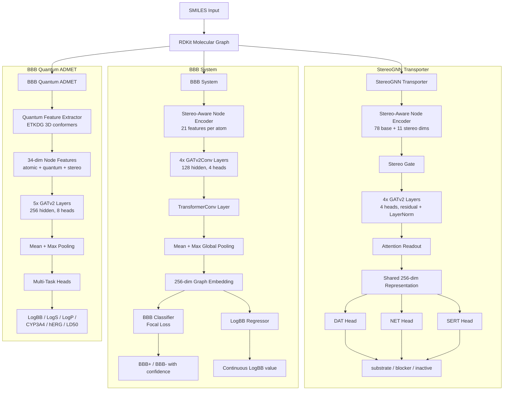

# Insilico Drug Discovery Toolkit

[](https://github.com/YOUR_USERNAME/Insilico-Drug-Discovery-Toolkit/actions/workflows/ci.yml)

A multi-endpoint ADMET prediction platform built on stereo-aware graph neural networks. The toolkit predicts blood-brain barrier permeability, monoamine transporter activity, and ADMET properties from molecular SMILES strings, with explicit handling of stereochemistry that most competing tools ignore.

## Why This Exists

Most ADMET prediction tools treat stereoisomers identically. This is a critical gap: (R)-thalidomide is a safe sedative while (S)-thalidomide causes birth defects; d-amphetamine is a potent DAT substrate while l-amphetamine is largely inactive. This toolkit encodes R/S chirality and E/Z geometry directly into the molecular graph, improving predictions on stereo-sensitive compounds.

---

## Models

### StereoGNN Transporter (MAT Predictor)

Predicts whether small molecules act as **substrates**, **blockers**, or **inactive** compounds at the three monoamine transporters (DAT, NET, SERT). Uses a two-stage training strategy: self-supervised pretraining on general SLC transporter data, then fine-tuning on curated monoamine-specific data (~650 compounds with stereo augmentation).

**Architecture:** Stereo-aware node encoder (78 base + 11 stereo features) feeds into 4 GATv2 message-passing layers with multi-head attention, followed by an attention readout and three target-specific classification heads. A learned stereo gate upweights chirality features when chiral centers are present.

| Metric | Value |
|--------|-------|
| Overall ROC-AUC | **0.968** |
| DAT AUC | 0.982 |
| NET AUC | 0.953 |
| SERT AUC | 0.969 |
| Stereo sensitivity | 83.3% |
| Dataset | ~650 compounds (post-augmentation) |

### BBB System (Blood-Brain Barrier Predictor)

Predicts BBB permeability using a stereo-aware GNN pretrained on 322,594 stereo-expanded ZINC molecules, then fine-tuned on BBBP (2,050 molecules) with pharma-relevant compound augmentation. V2 adds multi-task LogBB regression and inference-time stereoisomer enumeration.

**Architecture:** 21-feature stereo-aware node encoder into 4 GATv2Conv layers (128 hidden, 4 heads) with residual connections, followed by a TransformerConv layer, mean+max global pooling to a 256-dim embedding, and a 3-layer MLP classifier. Focal Loss (alpha=0.75, gamma=2.0) handles 80/20 class imbalance.

| Metric | V1 | V2 (Current) |
|--------|-----|--------------|
| External AUC (B3DB, 7,807 compounds) | 0.884 | **0.961** |
| Sensitivity | 98.6% | 97.96% |
| Specificity | 42.1% | **65.25%** |
| LogBB R^2 | N/A | **0.581** |
| CV AUC | 0.897 | **0.937** |

**Competitor comparison (external AUC on B3DB):**

| Model | AUC | Method |
|-------|-----|--------|
| **StereoGNN-BBB V2 (ours)** | **0.961** | GATv2 + stereo + Focal Loss |
| ADMETlab 2.0 | 0.910 | Multi-task DNN |
| AttentiveFP | 0.910 | Graph Attention Network |
| admetSAR 2.0 | 0.900 | Random Forest + fingerprints |
| ChemBERTa-77M | 0.900 | Transformer (SMILES) |
| pkCSM | 0.890 | Graph signatures + SVM |
| SwissADME | 0.840 | WLOGP + TPSA rule-based |

### BBB Quantum ADMET (In Development)

Extends the BBB system with 34-dimensional quantum-enhanced node features (atomic + quantum + stereo) using RDKit ETKDG 3D conformer generation. Multi-task regression across 6 ADMET endpoints: LogBB, LogS, LogP, CYP3A4, hERG, LD50. Not yet trained.

---

## Architecture Diagram



---

## Installation

**Prerequisites:** Python 3.9+, pip

```bash
git clone https://github.com/YOUR_USERNAME/Insilico-Drug-Discovery-Toolkit.git
cd Insilico-Drug-Discovery-Toolkit

# Create a virtual environment (recommended)
python -m venv venv
source venv/bin/activate  # Linux/macOS
# venv\Scripts\activate   # Windows

# Install core dependencies (covers all subprojects)
pip install torch torch-geometric rdkit-pypi numpy pandas scikit-learn

# For the web interfaces
pip install streamlit gradio pillow
```

Each subproject also has its own `requirements.txt`:

```bash
pip install -r StereoGNN_Transporter/requirements.txt
pip install -r BBB_System/requirements.txt
```

---

## Quick Start

### Transporter Prediction (StereoGNN)

```python
import sys
sys.path.insert(0, "StereoGNN_Transporter")
from inference import StereoGNNPredictor

predictor = StereoGNNPredictor("StereoGNN_Transporter/outputs/best_model.pt")

# Predict transporter activity for d-Amphetamine
result = predictor.predict("C[C@H](N)Cc1ccccc1")
print(result)
# {'DAT': {'substrate': 0.95, 'blocker': 0.03, 'inactive': 0.02},
#  'NET': {'substrate': 0.88, 'blocker': 0.08, 'inactive': 0.04},
#  'SERT': {'substrate': 0.45, 'blocker': 0.35, 'inactive': 0.20}}

# Compare enantiomers - the model distinguishes chirality
l_result = predictor.predict("C[C@@H](N)Cc1ccccc1")  # l-Amphetamine
print(f"d-Amp DAT substrate: {result['DAT']['substrate']:.2f}")   # ~0.95
print(f"l-Amp DAT substrate: {l_result['DAT']['substrate']:.2f}") # ~0.25
```

### BBB Permeability Prediction

```python
import sys
sys.path.insert(0, "BBB_System")
from predict_bbb import BBBGNNPredictor

predictor = BBBGNNPredictor()

result = predictor.predict("CN1C=NC2=C1C(=O)N(C(=O)N2C)C")  # Caffeine
print(f"BBB Score: {result['bbb_score']:.3f}")  # 0.782 (BBB+)

# Batch prediction
results = predictor.predict_batch([
    "CCO",              # Ethanol
    "c1ccccc1",         # Benzene
    "CC(=O)O",          # Acetic acid
])
for r in results:
    print(f"{r['smiles']}: {r['bbb_score']:.3f} ({r['category']})")
```

### Web Interfaces

```bash
# StereoGNN Transporter (Gradio)
cd StereoGNN_Transporter && python app.py

# BBB System (Streamlit)
cd BBB_System && streamlit run app.py
```

---

## Project Structure

```
Insilico-Drug-Discovery-Toolkit/
├── README.md                          # This file
├── StereoGNN_Transporter/             # Monoamine transporter predictor
│   ├── model.py                       # StereoGNN architecture
│   ├── featurizer.py                  # Molecular graph featurization
│   ├── inference.py                   # Prediction API
│   ├── app.py                         # Gradio web interface
│   ├── config.py                      # Hyperparameters
│   ├── run_training.py                # Training pipeline
│   ├── TECHNICAL_NOTE.md              # Full architecture documentation
│   └── models/                        # Trained weights
├── BBB_System/                        # Blood-brain barrier predictor
│   ├── bbb_predictor_v2.py            # V2 predictor with Focal Loss
│   ├── bbb_stereo_v2.py              # V2 training script
│   ├── app.py                         # Streamlit web interface
│   ├── TECHNICAL_SUMMARY.md           # Full technical documentation
│   ├── BENCHMARK_REPORT.md            # Competitor comparison
│   └── models/                        # Trained weights
├── BBB_Quantum_ADMET/                 # Quantum-enhanced ADMET (in dev)
│   ├── model.py                       # QuantumAwareEncoder
│   ├── quantum_features.py            # 34-dim feature extraction
│   ├── config.py                      # Multi-task configuration
│   └── train.py                       # Training loop
└── tests/                             # Pytest smoke tests
```

---

## License

MIT

## Citation

```bibtex
@software{insilico_drug_discovery_toolkit,
  title={Insilico Drug Discovery Toolkit: Stereo-Aware GNNs for ADMET Prediction},
  author={Yasini-Ardekani, N.},
  year={2025},
  url={https://github.com/YOUR_USERNAME/Insilico-Drug-Discovery-Toolkit}
}
```
