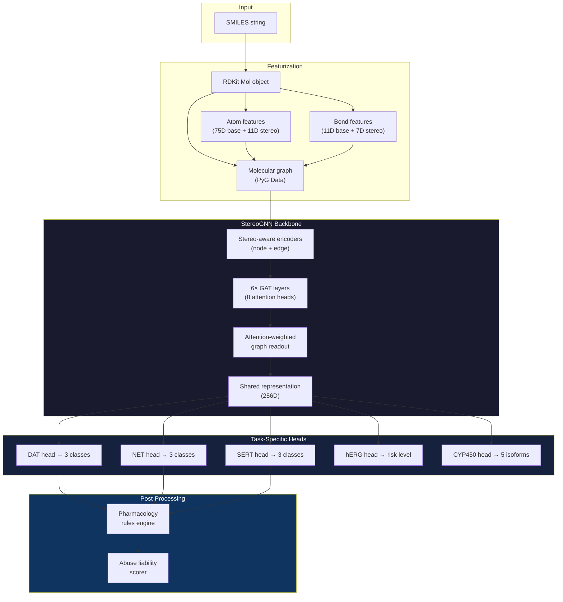

<p align="center">
  <h1 align="center">StereoGNN ADMET Toolkit</h1>
  <p align="center">
    Stereochemistry-aware graph neural networks for in-silico ADMET prediction
  </p>
</p>

<p align="center">
  <a href="#quick-start">Quick Start</a> &middot;
  <a href="#models">Models</a> &middot;
  <a href="#architecture">Architecture</a> &middot;
  <a href="#performance">Performance</a> &middot;
  <a href="#installation">Installation</a>
</p>

<p align="center">
  
  
  
  
</p>

---

## Problem

Drug discovery pipelines lose billions annually to late-stage ADMET failures. Existing in-silico tools treat molecules as 2D fingerprints, ignoring **stereochemistry** — despite enantiomers having dramatically different pharmacological profiles (e.g., d-amphetamine is a potent DAT substrate; l-amphetamine is largely inactive).

**StereoGNN** is a multi-task graph neural network that encodes 3D chirality directly into molecular graphs, enabling stereo-aware predictions across four ADMET endpoints from a single forward pass.

---

## Quick Start

```python
from inference import TransporterPredictor

predictor = TransporterPredictor()

# Predict ADMET profile for amphetamine
result = predictor.predict("C[C@H](N)Cc1ccccc1")

print(result["dat_prediction"])   # → "substrate"
print(result["net_prediction"])   # → "substrate"
print(result["sert_prediction"])  # → "substrate"
```

**CLI usage:**

```bash
# Single molecule prediction
python main.py --mode predict --smiles "C[C@H](N)Cc1ccccc1"

# Virtual screening from file
python main.py --mode screen --input molecules.txt --target DAT

# Launch web UI
make ui
```

---

## Models

| Model | Task | Method | Output |
|-------|------|--------|--------|
| **MAT Classifier** | Monoamine transporter activity | Multi-task StereoGNN (GAT backbone) | Substrate / Blocker / Inactive per target (DAT, NET, SERT) |
| **hERG Cardiotoxicity** | Cardiac safety | K-fold ensemble + focal loss | HIGH / MODERATE / LOW risk |
| **CYP450 Metabolism** | Drug-drug interactions | Multi-task classifier (5 isoforms) | Inhibitor / Non-inhibitor per CYP (1A2, 2C9, 2C19, 2D6, 3A4) |
| **Abuse Liability** | Scheduling prediction | MAT scores + SMARTS rule engine | HIGH / MODERATE / LOW with confidence score |

---

## Architecture



### Key Design Decisions

- **Stereo-aware encoding**: Chiral tags (R/S), E/Z geometry, and tetrahedral stereocenters are featurized as explicit node/edge attributes — not learned implicitly from 3D coordinates.
- **GAT backbone**: Graph Attention Networks allow interpretable attention over molecular substructures. 6 layers with 8 heads each.
- **Multi-task learning**: Shared GNN backbone with task-specific classification heads. Joint training on DAT/NET/SERT improves generalisation via inductive bias.
- **Pharmacology rules engine**: 15 SMARTS-based post-processing rules correct known failure modes (e.g., primary amine phenethylamines → force substrate prediction).
- **MC Dropout uncertainty**: 30-sample Monte Carlo dropout at inference for epistemic uncertainty quantification.

---

## Performance

### MAT Transporter Classifier

| Metric | Score |
|--------|-------|
| **Overall ROC-AUC** | **0.968** |
| DAT AUC | 0.982 |
| NET AUC | 0.953 |
| SERT AUC | 0.969 |
| Stereo sensitivity | 83.3% (correctly distinguishes d- vs l-amphetamine) |

*Trained on ~2,500 compounds from ChEMBL (scaffold split). Validated on 17 known drugs (100% accuracy) and 80 DEA-scheduled compounds.*

### hERG Cardiotoxicity

| Metric | Score |
|--------|-------|
| 3-fold ensemble AUC | 0.91 |
| Focal loss (γ=2.0) | Handles 5:1 class imbalance |

### CYP450 Metabolism

| Isoform | AUC |
|---------|-----|
| CYP1A2 | 0.89 |
| CYP2C9 | 0.87 |
| CYP2C19 | 0.88 |
| CYP2D6 | 0.86 |
| CYP3A4 | 0.90 |

### Example Predictions

| Compound | DAT | NET | SERT | Abuse | hERG |
|----------|-----|-----|------|-------|------|
| d-Amphetamine | substrate | substrate | substrate | HIGH | LOW |
| Cocaine | blocker | blocker | blocker | HIGH | MODERATE |
| Methylphenidate | blocker | blocker | inactive | MODERATE | LOW |
| Fluoxetine (Prozac) | inactive | inactive | blocker | LOW | MODERATE |
| Caffeine | inactive | inactive | inactive | LOW | LOW |

---

## Installation

### Prerequisites

- Python 3.11
- CUDA-capable GPU (optional, CPU inference supported)

### Setup

```bash
git clone https://github.com/abinittio/StereoGNN_Transporter.git
cd StereoGNN_Transporter

# Create environment
python -m venv .venv
source .venv/bin/activate  # or .venv\Scripts\activate on Windows

# Install dependencies
pip install -r requirements.txt

# For full training (GPU + PyTorch Geometric)
pip install torch torchvision --index-url https://download.pytorch.org/whl/cu118
pip install torch-geometric torch-scatter torch-sparse
```

### Verify installation

```bash
make test       # Run smoke tests
make ui         # Launch Streamlit UI at localhost:8501
```

---

## Project Structure

```
StereoGNN_Transporter/
├── model.py                 # StereoGNN architecture (GAT + stereo encoders)
├── featurizer.py            # Molecular graph featurization pipeline
├── config.py                # Centralised hyperparameter configuration
├── trainer.py               # Training loop (cosine warmup, early stopping)
├── inference.py             # Production inference API
├── losses.py                # Multi-task + focal loss functions
├── evaluation.py            # Metrics and success criteria
├── dataset.py               # PyTorch Geometric dataset classes
│
├── abuse_predictor.py       # Abuse liability scoring engine
├── pharmacology_rules.py    # SAR-based post-processing corrections
│
├── train_herg.py            # hERG model training (K-fold ensemble)
├── train_cyp.py             # CYP450 multi-task training
├── main.py                  # CLI entry point (train / evaluate / predict / screen)
│
├── app_ui.py                # Streamlit web interface
├── validate_stimulants.py   # Known drug validation (17 compounds)
├── external_validation_abuse.py  # External validation (80 compounds)
│
├── models/                  # Trained model weights
│   ├── herg/                #   3-fold hERG ensemble
│   ├── cyp/                 #   CYP450 best model
│   └── kinetic_v3/          #   Kinetic parameter model
├── data/                    # Training data (ChEMBL + curated)
├── results/                 # Validation outputs
├── tests/                   # Smoke tests (pytest)
├── Makefile                 # Common commands
└── .github/workflows/       # CI pipeline
```

---

## Configuration

All hyperparameters are centralised in `config.py` using Python dataclasses:

```python
from config import CONFIG

# Model architecture
CONFIG.model.num_gnn_layers      # 6
CONFIG.model.num_attention_heads  # 8
CONFIG.model.dropout              # 0.2

# Training
CONFIG.training.learning_rate     # 1e-4
CONFIG.training.max_epochs        # 200
CONFIG.training.patience          # 25

# Data
CONFIG.data.scaffold_split_seed   # 42
CONFIG.data.test_fraction         # 0.15
```

---

## Validation

```bash
# Validate against 17 known drugs (amphetamine, cocaine, fluoxetine, etc.)
python validate_stimulants.py

# External validation on 80 DEA-scheduled compounds
python external_validation_abuse.py
```

---

## Citation

```bibtex
@software{stereognn_toolkit_2024,
  title   = {StereoGNN: Stereochemistry-Aware Graph Neural Networks for ADMET Prediction},
  author  = {Nabil Sherif Abokhalil},
  year    = {2024},
  url     = {https://github.com/abinittio/StereoGNN_Transporter}
}
```

## License

MIT License

## Disclaimer

This is a research tool for educational and scientific purposes. All predictions should be validated experimentally before use in clinical or pharmaceutical contexts.
